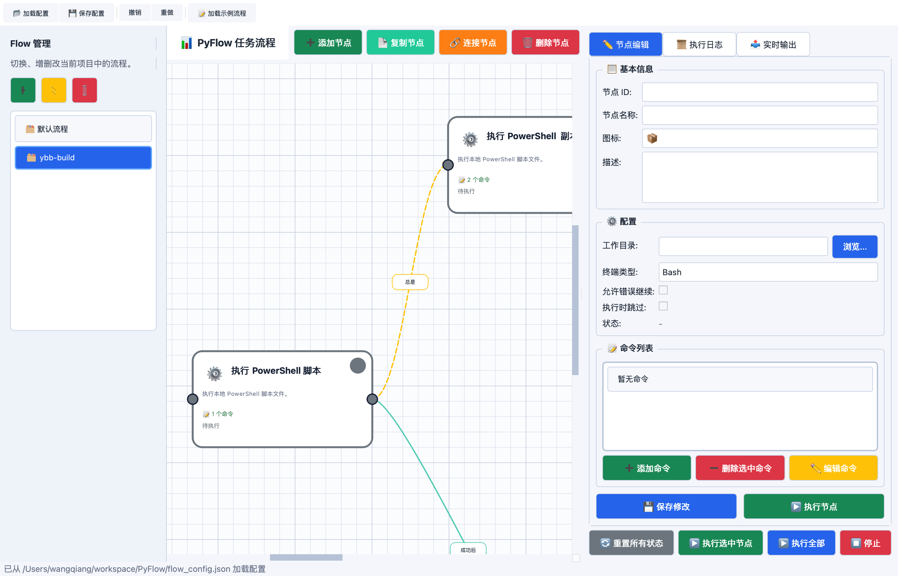

# PyFlow

PyFlow 是一个基于 `PySide6` 的桌面任务流编排工具，用可视化画布组织节点、连接执行链路，并按节点顺序执行本地命令。

目前项目核心实现集中在 `pyflow.py`，默认会读取同目录下的 `flow_config.json` 和 `node_templates.json`。

## 界面截图



## 功能特性

- 可视化 Flow 画布，支持拖拽节点、连线、网格显示。
- 支持多 Flow 管理，可新增、重命名、删除和切换流程。
- 节点支持名称、图标、描述、工作目录、失败后继续、执行时跳过等配置。
- 支持多条命令编排，并可在节点内增删改、拖拽排序命令。
- 支持 `CMD`、`PowerShell`、`Bash` 三种终端类型，并带有部分自动推断逻辑。
- 支持条件连接：`成功后`、`失败后`、`总是`。
- 执行前会做流程校验，包括循环依赖、不可达节点、空命令、无效工作目录、重复条件分支等检查。
- 执行时提供实时输出、执行日志，并为每个节点生成单独日志文件到 `logs/` 目录。
- 内置深色/浅色主题切换。
- 支持撤销 / 重做。
- 启动时自动加载 `flow_config.json`，保存时默认回写到该文件。
- 内置节点模板，当前仓库已提供多个 PowerShell 文件操作模板。

## 项目结构

- `pyflow.py`：主程序入口和主要界面逻辑。
- `flow_config.json`：当前默认加载的流程配置。
- `node_templates.json`：新增节点时可选的模板定义。
- `.github/workflows/python-app.yml`：CI 校验、PyInstaller 打包和 tag 发布流程。

## 运行方式

建议使用 Python 3.10+。

```bash
python -m pip install PySide6
python pyflow.py
```

也可以直接使用仓库内的 `requirements.txt`：

```bash
pip install -r requirements.txt
python pyflow.py
```

## 使用说明

1. 启动应用后，左侧选择或创建一个 Flow。
2. 点击“添加节点”创建节点，也可以从模板快速生成节点。
3. 为节点填写命令、工作目录、终端类型等信息。
4. 通过“连接节点”或画布连线建立执行关系，并设置触发条件。
5. 点击“执行选中节点”单独调试，或点击“执行全部”按链路运行整个 Flow。
6. 在“执行日志”和“实时输出”标签页查看运行结果。

## 配置说明

`flow_config.json` 当前使用的核心字段包括：

- `current_flow_id`：当前激活的 Flow。
- `theme`：主题，支持 `dark` / `light`。
- `flows`：Flow 列表。
- `flows[].nodes[]`：节点定义，包含 `id`、`name`、`icon`、`description`、`working_dir`、`continue_on_error`、`skip_in_flow`、`terminal_type`、`position`、`commands` 等字段。
- `flows[].connections[]`：节点连接关系，包含 `from`、`to` 和可选 `condition`。

`node_templates.json` 中的模板会出现在“添加节点”对话框中，适合封装常用脚本片段。

## 打包与发布

仓库内 GitHub Actions 已包含：

- `flake8` 代码检查
- `pytest` 测试执行（无测试时自动跳过）
- 使用 `PyInstaller` 在 Linux / Windows / macOS 上打包
- 在推送 tag 时自动生成 Release 附件

## 当前状态

这是一个单文件驱动的桌面原型项目，适合继续迭代以下方向：

- 补充 `requirements.txt`
- 增加自动化测试
- 拆分 `pyflow.py` 中的 UI、执行器和配置管理模块
